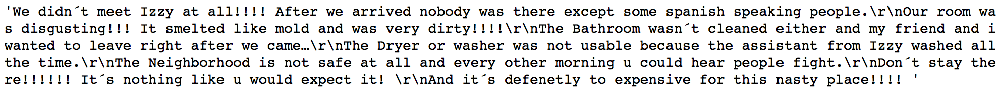

# Boston AirBnB Market Information Retrieval

## Motivation
Boston is one of the major cities in the United States. According to the Massachusetts Office of Travel and Tourism, Massachusetts hosted 24.2 million domestic visitors and 2.3 million international visitors in 2017. Before we travel, we would like to do some research about a city. For example, which area should we stay? What problems we may need to prepare in advance, Do we need to rent a car? 

With Boston AirBnB data, we may be able to retrieve some information. The data from Kaggle: https://www.kaggle.com/airbnb/boston includes calendar, listings and review of Boston AirBnB. In this project, I would like to provide insights for the following 3 questions:
	1. What are busy time to visit Boston?
	2. What do visitors like and dislike about their AirBnB journey in Boston?
	3. What are general vibes for different neighborhoods in Boston?

## What are busy time to visit Boston?
This calendar data includes price and availability info for 3585 listings. A listing is unavailable for 2 potential reasons:
	1. This listing is rented
	2. The owner of this listing does not make it available.

Hence, we can estimate the volume of visitors by both price and availability. When price rises up and availability drops down, there is a busy time to visit Boston.

This figure shows the average price and overall availability of 3585 AirBnB listings in Boston by each month. From January to August, price increases and availability decreases. In April, price sharply increases and availability drops to the lowest among these 8 months, which implies that April is a busy month for Boston to host visitors.

In September, price hugely increases and availability hugely drops. Starting from September, price decreases and availability increases. This calendar data has daily price and availability of 3585 listings only from Sep 06, 2016 to Sep 05, 2017. Here are 2 potential reasons for the huge change in September in this figure:
	1. More people do AirBnB business in 2017 than in 2016. Hence, customers have more new options and fewer people may choose the original listings in 2017.
	2. Not all of these 3585 listings have started to do AirBnB business since Sep 2016.

In general, with 2016-17 Boston AirBnB calendar data, April seems to be a busy month. More calendar years of data are recommended to further justify the overall trend and seasonally. 

## What do visitors like and dislike about their AirBnB journey in Boston?
68k reviews from 2009 to 2016 were classified into positive, neutral and negative comments using TextBlob and NLTK packages. Therefore I counted and found out the popular n-gram words in positive and negative comments. Thus we know what visitors like and dislike about their AirBnB journey in Boston.

93% of the reviews were classified as positive.

Here is an example of a positive review:

Here is an example of a neutral review:

Here is an example of a negative review:

Each text was tokenized, lemmatized and stopwords were removed. N-gram words were counted for positive and negative comments and 3-gram counts provide most information. In positive comments, short walk distance and great location were mostly mentioned, which implies that travelers do not need to rent a car like travelling in Los Angeles. Friendly host and clean apartment were also highly mentioned.

In negative comments, bad communication like 'never hear back from host' and 'difficult to get in touch with host' were highly mentioned. Also, messy and dirty kitchen were mentioned. These information tells travelers that travelers may choose an AirBnB in Boston based on their communication prior travel and a friendly host may probably lead travelers to one of those 93% positive experience.

### Further Improvement
A lot of reviews in this dataset were in foreign languages. Since Google Translate API is not free and has a tight limit, I cannot translate all of them into English. Instead, I tried to filter out non-English reviews since I cannot interpret word count on non-English comment. Hence, if we want to know opinions from foreigh travelers, we may need to pay for Google Translate API and apply the above methods. More negative comments are needed to justify the above result and provide more valuable insights.

## What are vibes for different neighborhoods in Boston?
Based on listing information, Allston-Brighton, Jamaica Plain, South End are the top 3 most common areas. The above N-gram word count method was applied to count key words of listing description in each of these neighborhoods and find their general vibes. 2-gram word count provides most information in this case.

Here is the 2-grams word count for Allston-Brighton. This result shows that this area is close to Harvard, Boston University, Boston College and Charles River. This area is full of young students and professionals and convenient for restaurants, grocery and metro.

Here is the 2-grams word count for Jamaica Plain. This result shows that this area has some must-go parks and places, including Arnold Arboretum, Franklin Park, Emerald Necklace, Adams Brewery, Southwest Corridor. Travelers can take orange line metro in this area to travel around.

Here is the 2-grams word count for South End. This result shows that this area has some good place to go shopping and have fine dinner, including Copley Mall, Back Bay, and the famous Newbury street. Boston Common Park is also highly mentioned.

